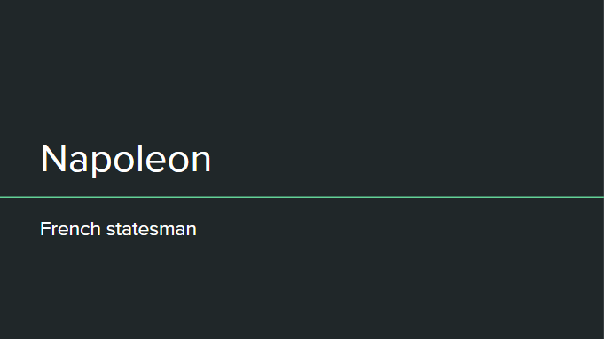
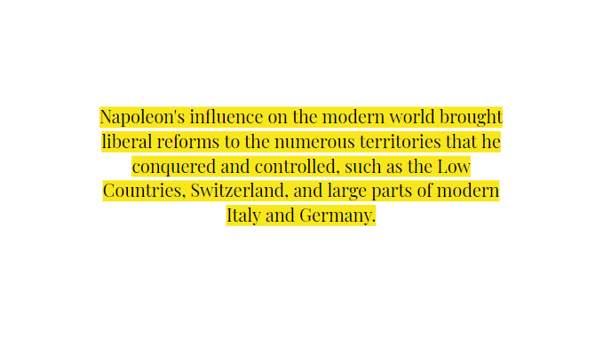
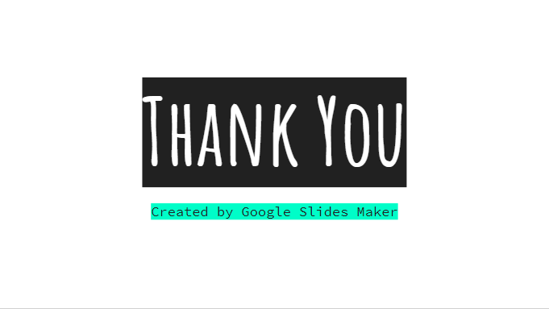

# gslides-maker v0.5 [beta]
<p>  </p>
<p>Generate Google Slides from Wikipedia content.</p>
<p>The presentation content is adaptable to all kinds of Google Presentation Themes available.</p>
<p>This beta version does not yet produce slides containing images. It only produces text content.</p>
<p>Contributions are welcome.</p>

---

## Installation and usage
Install gslides-maker globally using `-g` argument:
```
npm install -g gslides-maker
```
After that, run from your command line the following:
```
gslides-maker
```
## Adaptive Slides
<p> <p/>

### Adapted Text Content
The generated presentation is a `BLANK` theme. After the presentation is created, you can choose your favorite theme. The font style, size and color of the text content also change according to the chosen theme.

<p> </p>
<p> </p>

## Development
### Getting Started
```bash
# Clone this repository
$ git clone https://github.com/vilmacio22/gslides-maker.git

# Go into the repository
$ cd gslides-maker

# Install dependencies
$ npm install
```

### Technologies
This [node](https://nodejs.org/en/docs/) project was developed with [Typescript](https://www.typescriptlang.org/docs/home.html) using factory method pattern. [Sucrase](https://github.com/alangpierce/sucrase) is used for compiling and [Jest](https://jestjs.io/docs/en/getting-started) is used for testing. See `/package.json` for more information.

## License
This project is under the MIT license. See the [LICENSE](https://github.com/vilmacio22/gslides-maker/blob/master/LICENSE) for more information.

---

Created by [vilmacio](https://github.com/vilmacio)
